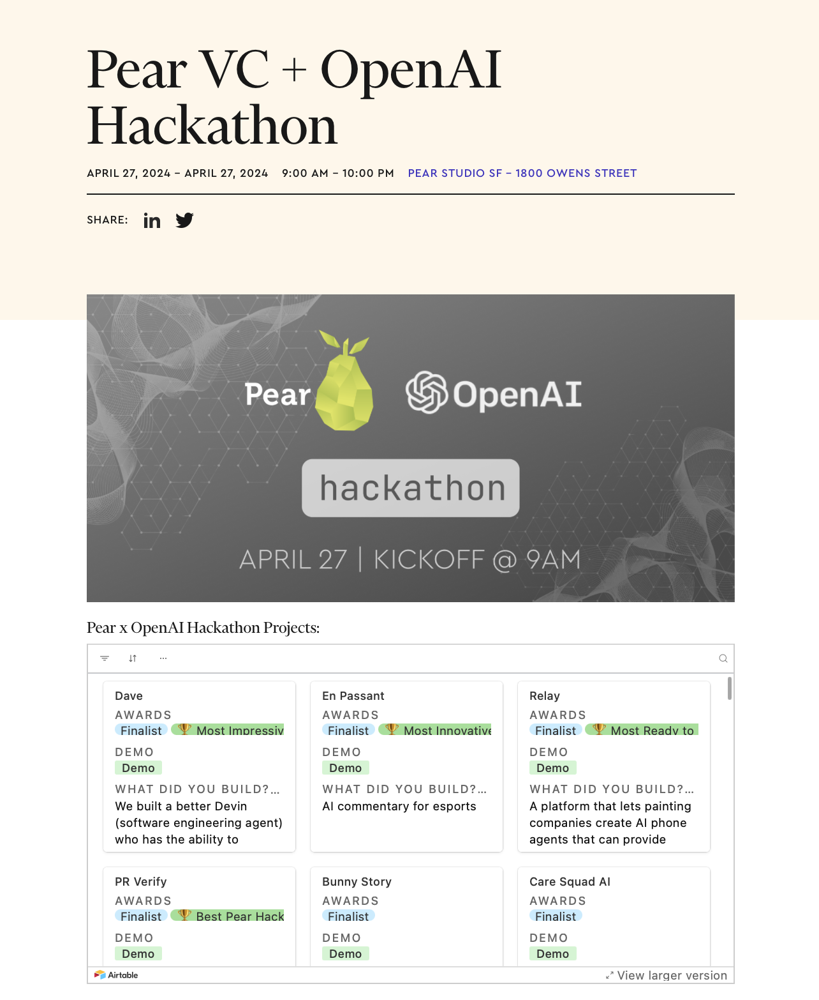
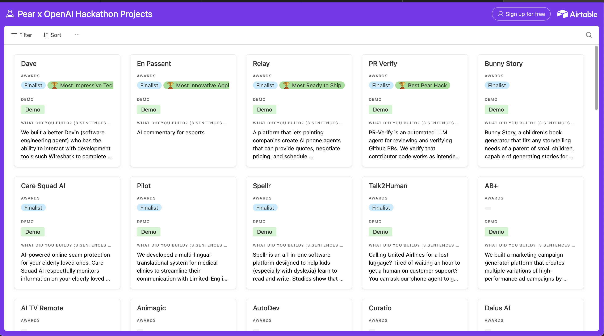

# En Passant - Chess Commentary for Pear VC + OpenAI Hackathon

## Hackathon Results

Results can be seen in this link: https://pear.vc/events/pear-vc-x-open-ai-hackathon/

We won "Most Innovative Application" Award at Pear VC + OpenAI Hackathon.

## Youtube Demo
* https://www.youtube.com/watch?v=VkvmBz_oC80

## How to Run

### Step 1
Run `bash setup.sh` to setup the python venv

## Step 2
Find audio clips of celebrities who you want to give commentary. Ideally, the celebrities should be speaking in the tone you like with low or no background audio. In our demo, we found audio clips of Aziz and Gordon.

### Step 3
Navigate to ElevenLabs -> Voices -> Click on "Add Generative or Cloned Voice" -> Click on "Instant Voice Cloning" and create the voice of the first celebrity using the audio file of the clip from Step 2.

### Step 4
Repeat the same process as Step 3 but for the other celebrity. Navigate to ElevenLabs -> Voices -> Click on "Add Generative or Cloned Voice" -> Click on "Instant Voice Cloning" and create a voice for the other celebrity using the audio file of the clip from Step 2.

### Step 5
For each of the two voices, hover over the top right icon labeled "ID" to find the Voice ID for each voice.

### Step 6
Fill in the following fields in the .env file:

* `OPENAI_API_KEY` - OpenAI Key
* `ELEVEN_LABS_API` - Eleven Labs API Key
* `CELEBRITY_VOICE_ID_1` - Voice ID for the first celebrity from ElevenLabs that you found on Step 3
* `CELEBRITY_VOICE_ID_2` - Voice ID for the second celebrity from ElevenLabs that you found on Step 4

### Step 7
Run the following command to run the application locally:

`streamlit run main_page.py`
